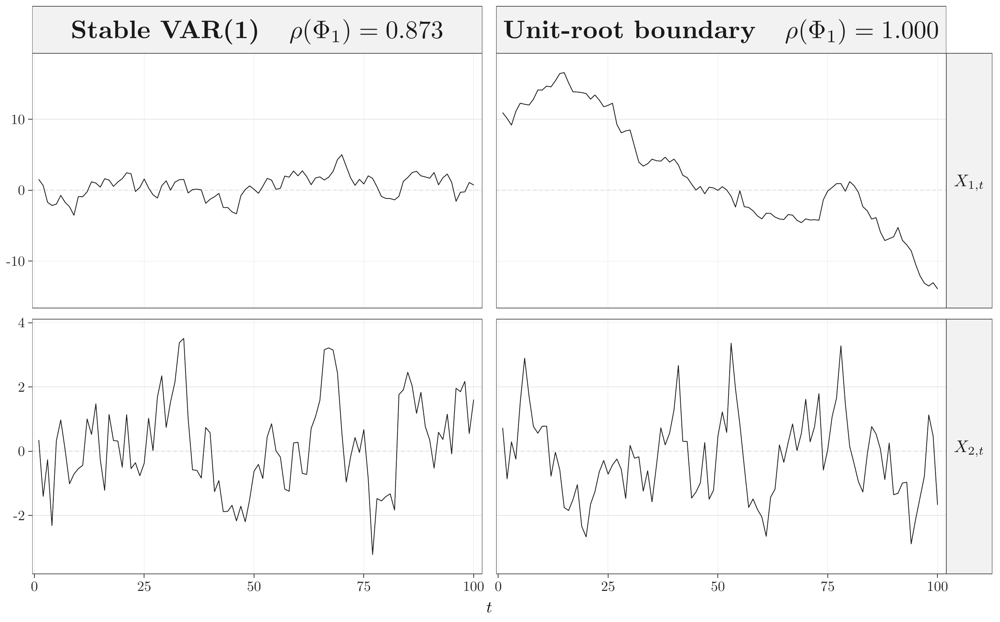
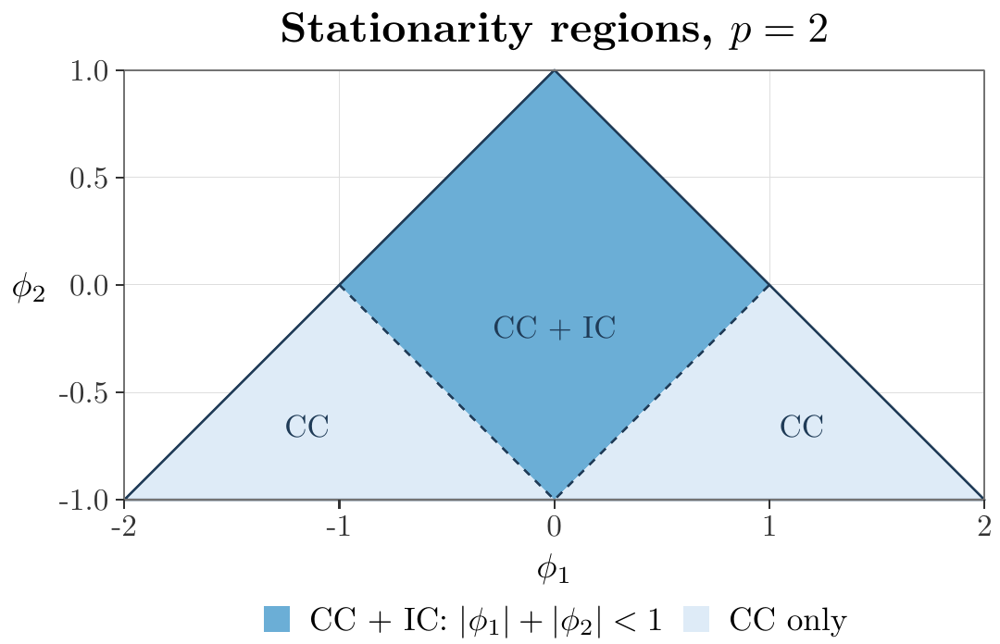
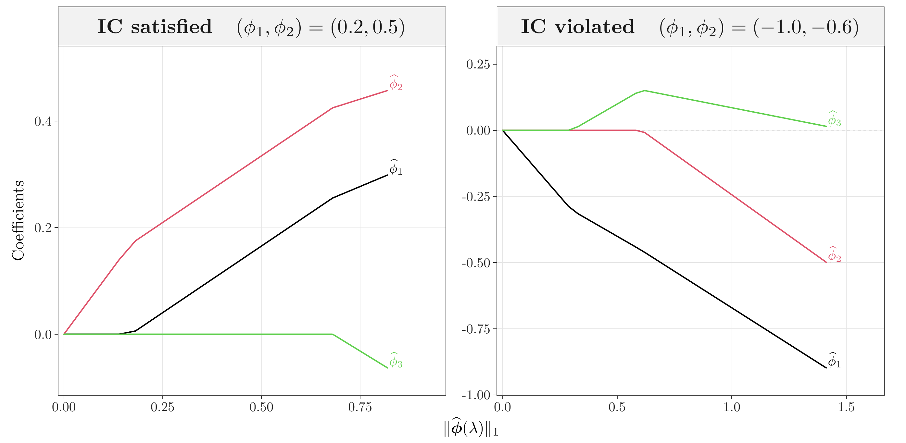

# High-Dimensional Time Series — Companion Code

<p align="center">
  <strong>Replication code, figure-generation scripts, and computational supplements</strong><br>
  for <em>High-Dimensional Time Series</em>
</p>

<p align="center">
  <strong>Changryong Baek · Marie Düker · Vladas Pipiras</strong>
</p>

<p align="center">
  <a href="https://hdts-book.github.io/">Project website</a>
  &nbsp;·&nbsp;
  <a href="#chapter-1-replication-index">Chapter 1 replication index</a>
  &nbsp;·&nbsp;
  <a href="#book-contents">Book contents</a>
  &nbsp;·&nbsp;
  <a href="#reproducibility">Reproducibility</a>
</p>

---

## About this repository

This repository accompanies the book **_High-Dimensional Time Series_** by Changryong Baek, Marie Düker, and Vladas Pipiras. It collects replication code, simulation scripts, figure-generation programs, and selected computational supplements used in the manuscript.

The current public repository focuses on **Chapter 1: Sparse vector autoregressive models**. Additional chapter materials will be added progressively as the corresponding code and figures are curated for public release.

> **Repository status.** The code base is under active development. Working folder names such as `Fig1`, `Fig4`, and `Fig5-lassopath` are repository identifiers and may not always coincide with the final figure numbering in the book.

**Current manuscript snapshot:** September 1, 2026  
**Project website:** https://hdts-book.github.io/

---

## Book contents

The current manuscript is organized as follows.

| Part | Title |
|---|---|
| Chapter 1 | **Sparse vector autoregressive models** |
| Chapter 2 | **Dynamic factor models** |
| Appendix A | **Matrix operations** |
| Appendix B | **Numerical optimization methods** |
| Appendix C | **Concentration inequalities** |
|  | **Bibliography** |

<details>
<summary><strong>Chapter 1 — detailed outline</strong></summary>

<br>

1. **Preliminaries of VAR**
2. **Sparse transition matrix structures**
3. **Linear regression perspectives**
4. **Stability of VAR models**
5. **Sparse VAR estimation**
6. **Equation-by-equation vs joint estimation**
7. **Estimation consistency**
8. **Support recovery and sparsistency**
9. **LASSO variants**
10. **Illustrations**
11. **VAR variants**
12. **Bayesian approaches**
13. **Miscellaneous**
14. **Exercises**
15. **Bibliographical notes**

</details>

<details>
<summary><strong>Chapter 2 — main sections</strong></summary>

<br>

1. **Factor representations, covariance structure, and identification**
2. **Likelihood methods in moderate dimension**
3. **High-dimensional estimation**
4. **Dynamic variants and augmented systems**
5. **Related low-dimensional structures**
6. **Exercises**
7. **Bibliographical notes**

</details>

---

## Chapter 1 replication index

Chapter 1 develops sparse VAR models from the population theory of stability and causality through high-dimensional LASSO estimation, support recovery, and structured extensions. The table below links the currently curated computational materials directly to their source code and available outputs.

| Working folder | Book topic | Source code | Web preview | Vector output | Status |
|---|---|---|---|---|---|
| `Fig1` | Stable vs. unit-root-boundary VAR(1) paths | [R script](Chapter1/Fig1/fig01_01_var_stability.R) | [PNG](Chapter1/Fig1/figures/fig01_01_var_stability.png) | [PDF](Chapter1/Fig1/figures/fig01_01_var_stability.pdf) | Available |
| `Fig2-ridge` | Geometry of LASSO and ridge constraints | [R script](Chapter1/Fig2-ridge/Ch1-lasso-ridge.R) | — | [PDF](Chapter1/Fig2-ridge/lasso_ridge_corrected.pdf) | Available |
| `Fig3-rate` | High-dimensional sparse-VAR estimation rates | — | — | — | In preparation |
| `Fig4` | AR(2) causality and irrepresentability regions | [R script](Chapter1/Fig4/fig_ar2_regions.R) | [PNG](Chapter1/Fig4/figures/fig_ar2_regions.png) | [PDF](Chapter1/Fig4/figures/fig_ar2_regions.pdf) | Available |
| `Fig5-lassopath` | AR(2)/AR(3) LASSO paths and the irrepresentability condition | [R script](Chapter1/Fig5-lassopath/fig01_04_ar_ir_condition_glmnet_v6_clean_title.R) | [PNG](Chapter1/Fig5-lassopath/figures/fig01_04_ar_ir_condition_glmnet_v6.png) | [PDF](Chapter1/Fig5-lassopath/figures/fig01_04_ar_ir_condition_glmnet_v6.pdf) | Available |
| `Fig8-grouplasso` | Group LASSO vs. standard LASSO geometry | [Jupyter notebook](Chapter1/Fig8-grouplasso/group-lasso-figure.ipynb) | — | [PDF](Chapter1/Fig8-grouplasso/group_lasso_plots.pdf) | Available |

### Selected figure previews

<table>
<tr>
<td width="50%" align="center">
  <a href="Chapter1/Fig1/figures/fig01_01_var_stability.pdf">
    
  </a>
  <br>
  <sub><strong>VAR(1) stability.</strong> Stable and unit-root-boundary sample paths.</sub>
</td>
<td width="50%" align="center">
  <a href="Chapter1/Fig4/figures/fig_ar2_regions.pdf">
    
  </a>
  <br>
  <sub><strong>AR(2) parameter regions.</strong> Causality and irrepresentability conditions.</sub>
</td>
</tr>
</table>

<p align="center">
  <a href="Chapter1/Fig5-lassopath/figures/fig01_04_ar_ir_condition_glmnet_v6.pdf">
    
  </a>
  <br>
  <sub><strong>LASSO coefficient paths.</strong> Comparison of cases satisfying and violating the irrepresentability condition.</sub>
</p>

---

## Repository structure

```text
.
├── Chapter1/
│   ├── Fig1/
│   │   ├── fig01_01_var_stability.R
│   │   └── figures/
│   ├── Fig2-ridge/
│   │   ├── Ch1-lasso-ridge.R
│   │   └── lasso_ridge_corrected.pdf
│   ├── Fig3-rate/
│   ├── Fig4/
│   │   ├── fig_ar2_regions.R
│   │   └── figures/
│   ├── Fig5-lassopath/
│   │   ├── fig01_04_ar_ir_condition_glmnet_v6_clean_title.R
│   │   └── figures/
│   └── Fig8-grouplasso/
│       ├── group-lasso-figure.ipynb
│       └── group_lasso_plots.pdf
└── README.md
```

For TikZ-based figures, the `figures/` directory generally contains:

- `.pdf` — publication-quality vector output;
- `.png` — browser-friendly preview;
- `.tex` — TikZ/LaTeX source generated from the plotting script.

Files such as `.aux` and `.log` are LaTeX build artifacts rather than scientific outputs.

---

## Reproducibility

Individual figure directories are designed to be run independently. Because output paths are relative to each figure directory, the most reliable workflow is to enter the corresponding directory before running the script.

For example:

```bash
cd Chapter1/Fig1
Rscript fig01_01_var_stability.R
```

and

```bash
cd Chapter1/Fig5-lassopath
Rscript fig01_04_ar_ir_condition_glmnet_v6_clean_title.R
```

### Main software used

The exact dependencies vary by figure. Current Chapter 1 materials use combinations of:

**R**
- `ggplot2`
- `glmnet`
- `sparseVAR`
- `tikzDevice`
- `patchwork`
- `pdftools` (optional, for PDF-to-PNG conversion)

**Python**
- `numpy`
- `matplotlib`
- Jupyter

**System tools**
- a LaTeX installation with `pdflatex` for TikZ-based publication figures.

Each source file should be treated as the authoritative record of the packages and options needed for that particular computation.

---

## Numerical methods

The computational material is closely connected to the methodological developments in the book. In particular, the appendices collect supporting material on

- matrix operations and perturbation arguments;
- coordinate descent for sparse VAR estimation;
- ADMM and FISTA algorithms;
- concentration inequalities used in the high-dimensional theory.

The figure scripts in this repository are intended to complement, rather than replace, the mathematical definitions and assumptions stated in the book.

---

## Citation

If you use the code or figures from this repository in academic work, please cite the book manuscript:

> **Baek, C., Düker, M., and Pipiras, V.**  
> _High-Dimensional Time Series_.  
> Manuscript, September 2026.

A formal bibliographic entry will be added when publication information is finalized.

---

## Notes for readers

- The repository is being synchronized with the evolving manuscript.
- Figure numbers, filenames, and captions may change before the final book release.
- The PDF outputs are intended for publication and typesetting; PNG files are provided primarily for web preview.
- Questions about a specific numerical example are best referenced by both its book section and its repository folder.

---

<p align="center">
  <a href="https://hdts-book.github.io/"><strong>hdts-book.github.io</strong></a>
</p>
